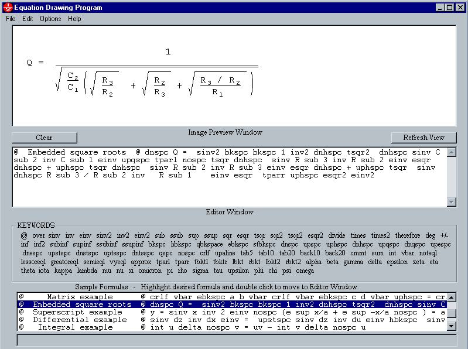



## Equation Drawing

### Description

Math Equation to bitmapped image formatting program using plain english keywords (98 of them) in a text entry box. Includes cropping and saving as a B&W bmp.
 
### More Info
 

             |
---                |---
**Submitted On**   |2002-08-10 21:19:54
**By**             |[Vic Richardson](https://github.com/Planet-Source-Code/PSCIndex/blob/master/ByAuthor/vic-richardson.md)
**Level**          |Beginner
**User Rating**    |4.7 (47 globes from 10 users)
**Compatibility**  |VB 6\.0
**Category**       |[Complete Applications](https://github.com/Planet-Source-Code/PSCIndex/blob/master/ByCategory/complete-applications__1-27.md)
**World**          |[Visual Basic](https://github.com/Planet-Source-Code/PSCIndex/blob/master/ByWorld/visual-basic.md)
**Archive File**   |[Equation\_D1167688112002\.zip](https://github.com/Planet-Source-Code/vic-richardson-equation-drawing__1-37786/archive/master.zip)

